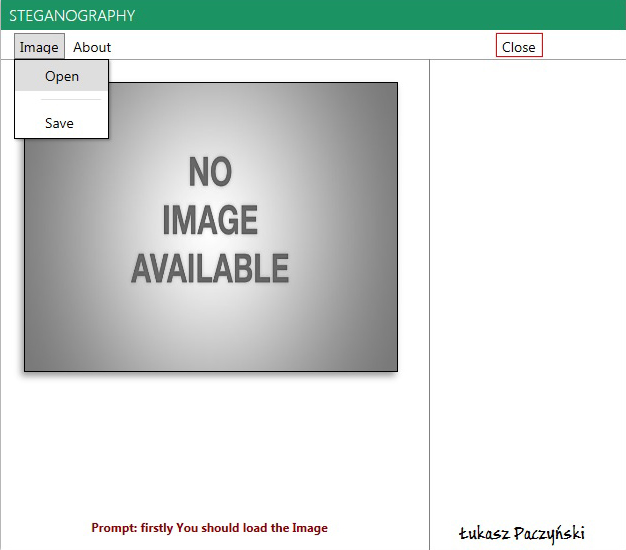
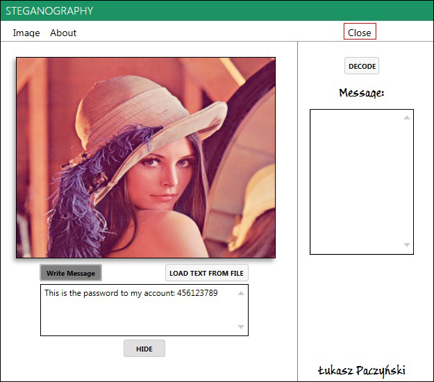
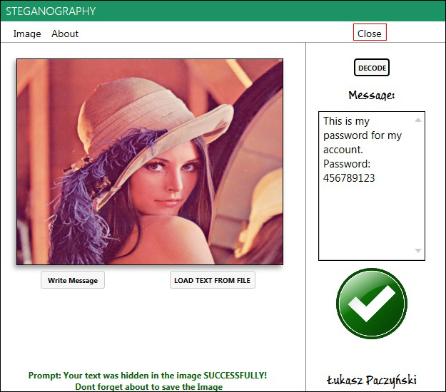
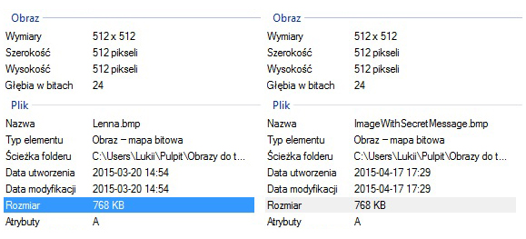

### Steganography
This application was written as a part of the master thesis.

## About app:
```
Let's say that you want to send a secret message hidden in an image to your friend 
without anyone knowing about it. This application makes it possible. 
All you have to do is select your image, type in the secret message
and then save the image. Afterwards you can send the image containing the hidden message
to your friend and he can decode it using the same application.
```

## Instructions:
```
As a sender:
1) Load image. Click Image > Open > select the image. Extensions: *.bmp, *.jpg, *.jpeg
2) Type in the secret message. You have to choose one of two possibilities: 
    Type in the Message or load text from file (extension *.txt)
3) Click Hide
4) Save the new image
5) Send the image to your friend using for example: email, facebook, or something else

As a reciver:
1) Load image. Click Image > Open > select the image from your friend
2) Click Decode Button and read the message

Prompt - Gives us tips what should we do at certain moments and informs us about the errors.

This application supports ASCII encoding only!
```
## Screenshots:



----


----


----


----

## Requirements:

OS: Windows Vista / 7 / 8 / 8.1 / 10

Microsoft .NET Framework 4.5 - [download here] (https://www.microsoft.com/pl-pl/download/details.aspx?id=30653)

## Download App:
soon..
