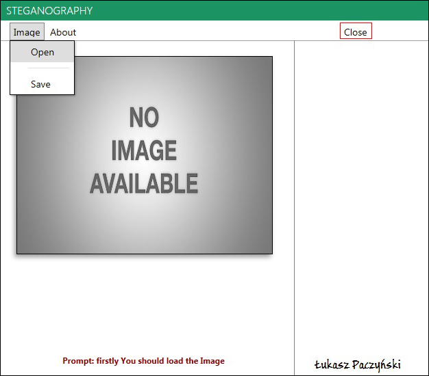
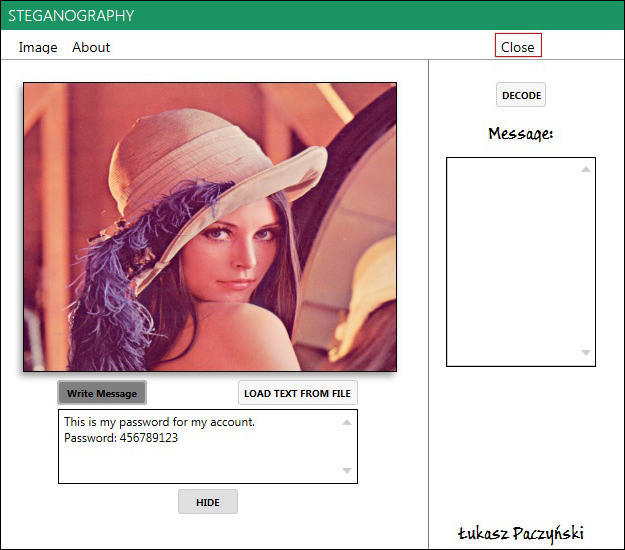
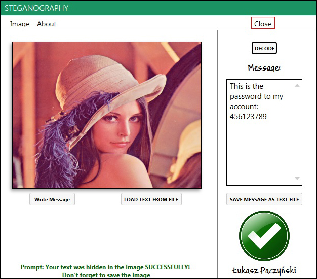
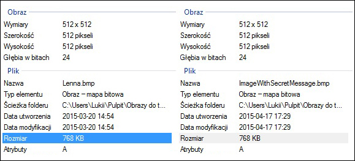

### Steganography
This application was written as a part of the master thesis.

## About app:
```
Imagine that you want send a secret message to your friend without the knowledge 
of other people. Using this application it will be possible. You just need to select 
the image in what do you want to hide the secret message and click encrypt - simple, right? 
On the next step you can send the image with the message to your friend, 
which decode that and read the secret message.
```

## Instructions:
```
As a sender:
1) Load image. Click Image > Open > select the image. Extensions: *.bmp, *.jpg, *.jpeg
2) Write the secret message. You have the choise to select one of two possibilities: 
    Write Message or load text from file (extension *.txt)
3) Click Hide
4) Save the new image
5) Send the image to your friend using, for example: email, facebook, or somethink else

As a reciver:
1) Load image. Click Image > Open > select the image from your friend
2) Click Decode Button and read the message

Prompt - tells us what we should to do at the moment or inform us about errors.
```
## Screenshots:



----


----


----


----

## Requirements:

OS: Windows Vista/ 7 / 8 / 8.1

Microsoft .NET Framework 4.5 - [download here] (https://www.microsoft.com/pl-pl/download/details.aspx?id=30653)

## Download App:
soon..
